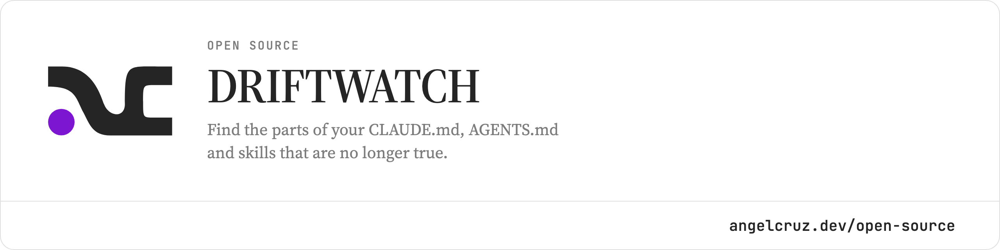

<picture>
  <source media="(prefers-color-scheme: dark)" srcset=".github/driftwatch-dark.png">
  
</picture>

# driftwatch

[](https://www.npmjs.com/package/@abr4xas/driftwatch)
[](https://github.com/abr4xas/driftwatch/actions/workflows/ci.yml)
[](./LICENSE)

Find the parts of your `CLAUDE.md`, `AGENTS.md` and skills that are no longer true.

> `knip` finds dead code. driftwatch finds **dead context**.

```console
$ driftwatch
AGENTS.md
  ✗ 3  src/util/date.ts  path does not exist  → src/helpers/date.ts?
  ✗ 5  src/cli.ts        path does not exist

1 file · 2 problems (2 errors) · 59ms
1 fixable with --fix
```

```bash
npx @abr4xas/driftwatch
```

Needs Node 24 or newer. No configuration, no API key, no network.

## The problem

Your `AGENTS.md` says the entry point is `src/cli.ts`. Six months ago it was.

Nobody notices, because nothing reads that file except the agent — and the agent does not notice either. It reads the claim, believes it, and looks for a file that is not there. Then it guesses. A stale context file does not fail loudly like a broken test; it degrades every session quietly, and the better your instructions were, the more confidently they are wrong.

Linters check your code. Nothing checks the document you wrote *about* your code.

## What it checks

- `path/missing` — every path a context file claims exists, verified against the repo index.
- `script/missing` — the package manager commands a document tells you to run, against the nearest `package.json`, `Makefile` or `deno.json`.
- `link/broken` — a Markdown link to an anchor no heading in the target document produces.
- `frontmatter/invalid` — YAML that does not parse, and fields whose type the format fixes.
- `skill/frontmatter` — a `SKILL.md` whose `name` is not the directory it lives in.

`path/missing` is the one that pays for the project, because the paths are what an agent acts on, and it is the one that had to survive being wrong: it was certified against a corpus of **66 real repositories** before anything else was allowed to land, and **61 of them produce no false positive at all**.

That is the rule the whole tool is built on — **one false positive costs more than ten false negatives** — and [docs/guide/precision.md](./docs/guide/precision.md) is the argument, with the numbers and the rounds where they broke.

## Fixing what it finds

```bash
driftwatch --fix --dry-run    # what it would change
driftwatch --fix              # change it
```

It applies a correction only when there is exactly one candidate above 0.8 confidence, it replaces the claim and nothing around it, and it refuses outright to rewrite a relative path in a document that is not at the repo root. [docs/guide/fixing.md](./docs/guide/fixing.md) has the whole list of what it will not touch, and why.

## In CI

```yaml
- uses: actions/checkout@v7
- uses: abr4xas/driftwatch@v0.4.0
```

Every stale claim becomes an annotation on the diff, on the line that makes it. `fail-on-drift: false` makes it advisory, `sarif: true` writes a file for Code Scanning. See [docs/guide/ci.md](./docs/guide/ci.md), or [docs/guide/output.md](./docs/guide/output.md) for the formats themselves.

## Learn more

| Where | What is in it |
|---|---|
| [docs/guide/](./docs/guide/README.md) | using it: the checks, the flags, the fixes, the output formats, the precision numbers |
| [docs/spec/](./docs/spec/README.md) | the reference specification: brief, spec, architecture, roadmap |
| [docs/adr/](./docs/adr/) | decision records, including the ones that cost precision |
| [test/corpus/](./test/corpus/README.md) | the 66-repo corpus: the only false positive measurement there is |
| [AGENTS.md](./AGENTS.md) | the handoff for the agent doing the building |

The specification is primary source: when the code and those documents disagree, the first step is deciding which one is wrong, not adjusting the document to fit ([ADR-0001](./docs/adr/0001-the-specification-lives-inside-the-repo.md)).

## Status

**It is on npm, and it is early.** The badge above carries the published version, so this paragraph does not have to and cannot go stale. M0 through M3 are done: the five checks and `--fix`. M4 has delivered the `--json` / `--github` / `--sarif` formats and the GitHub Action; what is left of it is the audience — a GIF and a one-page site.

Early means the checks and the fixes are what is finished. `--watch` and `--strict` parse and then tell you which milestone they belong to; the four tier 2 checks land in M5.

**The package is scoped, the Marketplace listing is suffixed, and the command is neither.** npm refuses `driftwatch` for being too similar to `drift-watch`, an unrelated tool that analyses agent *conversations* rather than the documents they read; the GitHub Marketplace refuses it too, because a user account called Driftwatch already exists and a listing name has to be unique across every action, user and organisation. So the package is `@abr4xas/driftwatch` and the listing is `driftwatch-action`.

Neither reaches you. `bin` fixes the command at `driftwatch` whatever the package is called, and the action is used as `abr4xas/driftwatch@v0.4.0`, which comes from the repository rather than from the listing.

## License

[MIT](./LICENSE).
